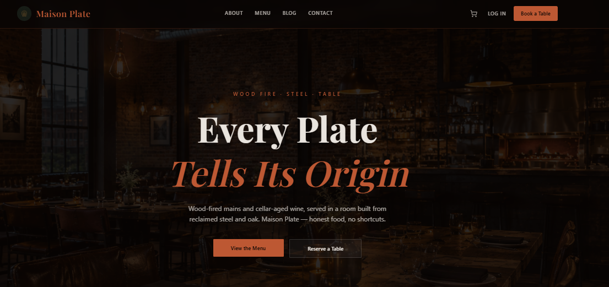

<div align="center">

# 🍽️ Maison Plate

  <p><strong>A modern, full-stack enterprise restaurant platform featuring seamless online ordering, table reservations, PWA offline capabilities, and a robust administration CMS.</strong></p>

  <p>
    
    
    
    
    
    
  </p>
</div>

---

## 📸 Hero Preview

<p align="center">
  
</p>

---

## 🚀 About The Project

**Maison Plate** is a production-grade restaurant platform engineered to bridge the gap between restaurant management and customer engagement. It features a decoupled architecture powered by a high-performance **Laravel 12 API backend** and a blazing-fast **Next.js 15 (App Router) frontend**. 

Designed with modern UX patterns, it supports Progressive Web App (PWA) installation for offline usage, real-time table availability checking, secure token-based authentication via Laravel Sanctum, and an expansive admin CMS for complete restaurant operations control.

---

## ✨ Key Features

### 👤 Customer Experience
- **Progressive Web App (PWA):** Fully installable with offline support and caching for mobile and desktop.
- **Dynamic Menu Browsing:** Category filtering, product detail views, and real-time inventory checks.
- **Smart Cart & Orders:** Seamless shopping cart management, address saving, and order tracking.
- **Table Reservations:** Real-time availability checks and slot-conflict validation.
- **Secure Authentication:** User registration, profile management, email verification, and password resets via Laravel Sanctum.

### 🛠️ Administration & CMS
- **Analytics Dashboard:** Visual metrics and operational analytics for business tracking.
- **Content Management System (CMS):** Complete management for announcements, blog posts, events, testimonials, site settings, and menu products.
- **Customer Relationship Management:** Handles support tickets, contact form submissions, and customer data safely.

---

## ⚙️ Tech Stack

### Backend (`api/`)
* **Framework:** Laravel 12 (PHP 8.4)
* **Authentication:** Laravel Sanctum (Token-based API auth)
* **Database & ORM:** MySQL 8.0, Eloquent ORM, Migrations & Seeders
* **Media Processing:** Intervention Image
* **Testing:** PHPUnit

### Frontend (`web/`)
* **Framework:** Next.js 15 (App Router) + React 19 + TypeScript
* **State & Data Fetching:** Zustand, TanStack Query
* **Forms & Validation:** React Hook Form + Zod
* **Styling & UI:** Tailwind CSS, Radix UI primitives
* **PWA Engine:** `@ducanh2912/next-pwa`

### Infrastructure
* **Containerization:** Docker Compose
* **Database:** MySQL 8.0

---

## 📂 Project Structure

```text
.
├── .github/
│   └── images/
│       └── hero-section.png  # Hero section screenshot
├── api/                      # Laravel 12 REST API backend
├── web/                      # Next.js 15 frontend application
├── docker-compose.yml        # Multi-container local orchestration
└── README.md